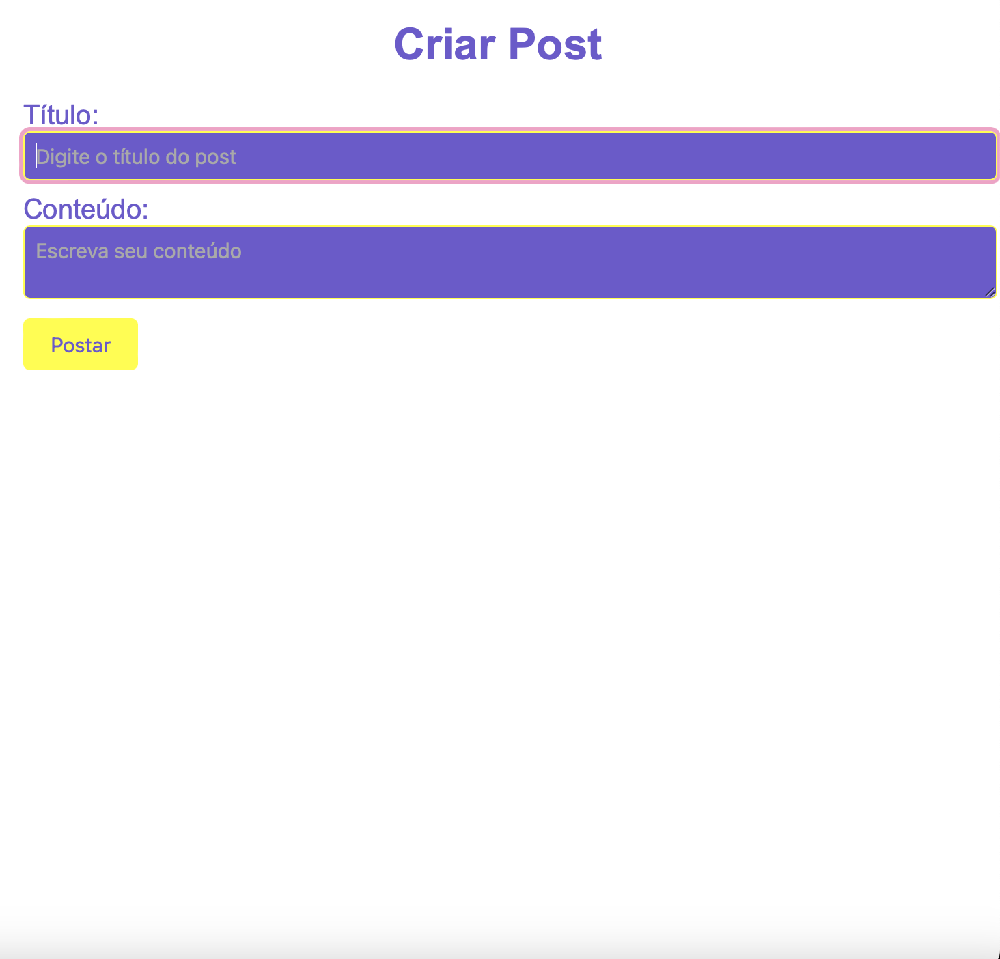
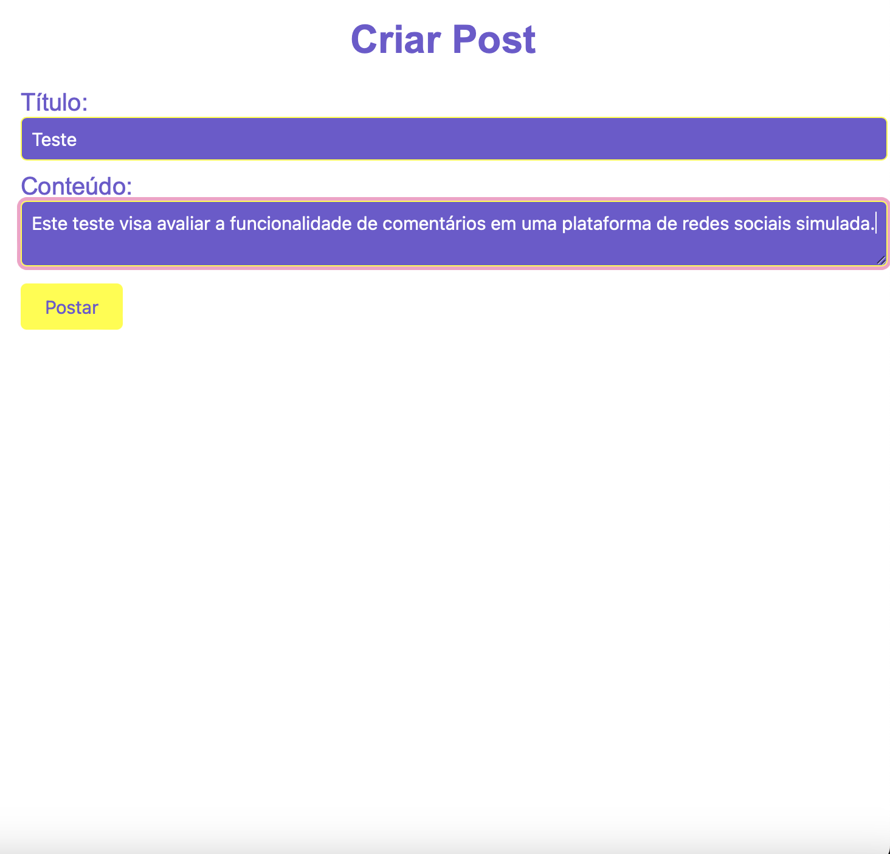
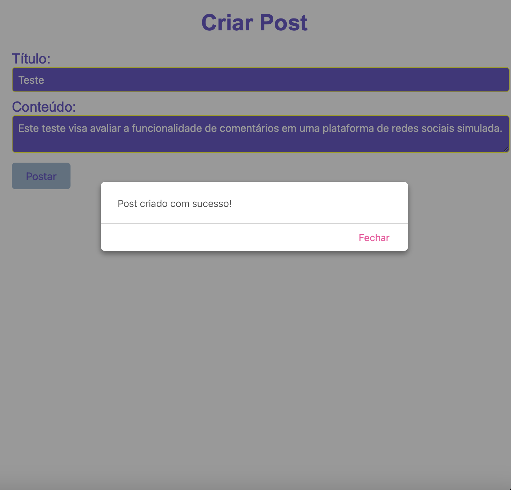

## Projeto de Postagem Simulada

Este é um projeto simples que simula a criação de uma postagem semelhante a plataformas de redes sociais como Facebook, LinkedIn, entre outras. 
Ele utiliza HTML, CSS e JavaScript para criar uma interface de usuário básica e se comunica com uma API fictícia para criar uma postagem simulada.

 

## Funcionalidades

<b>Criar Postagem:</b> Permite ao usuário inserir um título e um conteúdo para criar uma postagem simulada.
 
<b>Comunicação com API:</b> Simula uma requisição POST para uma API, utilizando o serviço de testes.

  

